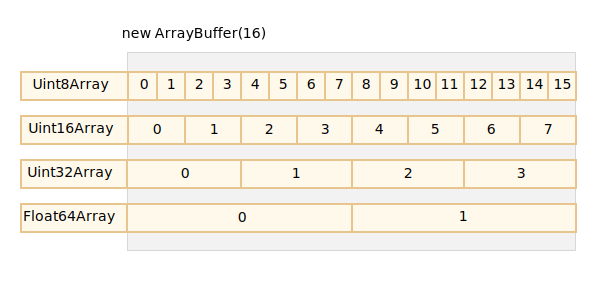
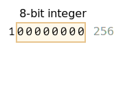
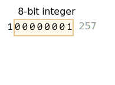
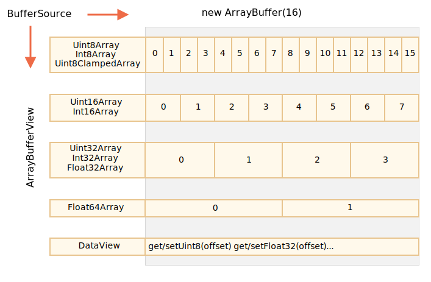

# ArrayBuffer，二进制数组

在 web 开发中，进行文件处理操作（创建、上传、下载）时，我们通常要用到二进制数据。另一个典型的应用场景便是图像处理。

JavaScript 中同样也会遇到，而且二进制操作性能也高。

不过，由于 JavaScript 中有很多类，会有点容易混淆。稍微列举几个：
- `ArrayBuffer`，`Uint8Array`，`DataView`，`Blob`，`File`，不一而足。

与其他语言相比较，JavaScript 中二进制的实现方式不是很标准。但当我们理清楚以后，一切就变得相当简单了。

**最基本的二进制对象是 `ArrayBuffer` -- 对固定长度的相邻内存空间的引用。**

我们如下创建一个 ArrayBuffer：
```js run
let buffer = new ArrayBuffer(16); // 创建一个长度为 16 的缓存区
alert(buffer.byteLength); // 16
```

这会分配一个 16 字节的连续内存空间，并预填充为 0。

```warn header="`ArrayBuffer` 不是某个东西的数组"
让我们来澄清一个可能的误区。`ArrayBuffer` 完全不同于 `Array`：
- 其长度固定，我们无法增加或减少。
- 它在内存中就正好占据那些空间。
- 如要访问单个字节，需要另一个"视图（view）"对象，而不是 `buffer[index]`。
```

`ArrayBuffer` 是一个内存空间。里面储存的是什么呢？它本身并不知道。只是字节的原始序列。

**如要操作 `ArrayBuffer`，我们需要使用一个"视图（view）"对象。**

视图对象本身并不存储任何元素，它是一副”眼镜“，透过它来解析存储在 `ArrayBuffer` 中的字节。

例如：

- **`Uint8Array`** -- 将 `ArrayBuffer` 中的每个字节视为一个独立的 0 到 255 之间的数字（一个字节是 8 位，因此只能容纳这么多）。该数字称为 "8 位无符号整数"。
- **`Uint16Array`** -- 将每 2 个字节视为一个 0 到 65535 之间的整数。该数字称为 "16 位无符号整数"。
- **`Uint32Array`** -- 将每 4 个字节视为一个 0 到 4294967295 之间的整数。该数字称为 "32 位无符号整数"。
- **`Float64Array`** -- 将每 8 个字节视为一个 <code>5.0x10<sup>-324</sup></code> 到 <code>1.8x10<sup>308</sup></code> 之间的整数。

因此，在一个 16 字节的 `ArrayBuffer` 中，其二进制数据可以表示为 16 个 "小数字"，或 8 个大点的数字（每个数字 2 个字节），或 4 个更大的数字 (每个数字 4 个字节)，或 2 个高精度的浮点数（每个数字 8 个字节）。



`ArrayBuffer` 是核心对象，是所有对象的基础，是原始二进制数据。

但是，如果我们想写入值，或遍历之，基本上对于几乎所有的操作，我们必须使用视图（view），比如：

```js run
let buffer = new ArrayBuffer(16); // 创建一个长度为 16 的缓存区

*!*
let view = new Uint32Array(buffer); // 将缓存区视为一串 32 位整数

alert(Uint32Array.BYTES_PER_ELEMENT); // 每个整数 4 个字节
*/!*

alert(view.length); // 4，储存了 4 个整数
alert(view.byteLength); // 16，大小，以字节数计

// 让我们写入一个值
view[0] = 123456;

// 遍历这些值
for(let num of view) {
  alert(num); // 123456，然后是 0，0，0 (一共 4 个值)
}

```

## 类型化数组（TypedArray）

所有这些视图（`Uint8Array`、`Uint32Array`等）有一个通用术语是 [TypedArray](https://tc39.github.io/ecma262/#sec-typedarray-objects)。它们都享有同一组方法和属性。

它们更像普通数组：有索引，可遍历。


一个类型化数组（无论是 `Int8Array` 或 `Float64Array`），其构造器因参数类型而异。

有 5 种参数变量：

```js
new TypedArray(buffer, [byteOffset], [length]);
new TypedArray(object);
new TypedArray(typedArray);
new TypedArray(length);
new TypedArray();
```

1. 如果给定的是 `ArrayBuffer` 参数，则在其上创建视图。我们已经用过该语法了。

    Optionally we can provide `byteOffset` to start from (0 by default) and the `length` (till the end of the buffer by default)，then the view will cover only a part of the `buffer`.

2. 如果给定的是 `Array`、或任何类似数组的对象，则创建一个相同长度的类型化数组，并复制其内容。

    我们可以通过此构造器用该数据来预填充数组:
    ```js run
    *!*
    let arr = new Uint8Array([0, 1, 2, 3]);
    */!*
    alert( arr.length ); // 4
    alert( arr[1] ); // 1
    ```
3. 如果给定的是另一个 `TypedArray`，也是如此：创建一个相同长度的类型化数组，并复制其内容。数据在此过程中被转换为新的类型。
    ```js run
    let arr16 = new Uint16Array([1, 1000]);
    *!*
    let arr8 = new Uint8Array(arr16);
    */!*
    alert( arr8[0] ); // 1
    alert( arr8[1] ); // 232 (试图复制 1000，但无法将 1000 放进 8 位字节中。)
    ```

4. For a numeric argument `length` -- creates the typed array to contain that many elements. Its byte length will be `length` multiplied by the number of bytes in a single item `TypedArray.BYTES_PER_ELEMENT`:
    ```js run
    let arr = new Uint16Array(4); // create typed array for 4 integers
    alert( Uint16Array.BYTES_PER_ELEMENT ); // 2 bytes per integer
    alert( arr.byteLength ); // 8 (size in bytes)
    ```

5. Without arguments，creates an zero-length typed array.

We can create a `TypedArray` directly，without mentioning `ArrayBuffer`. But a view cannot exist without an underlying `ArrayBuffer`，so gets created automatically in all these cases except the first one (when provided).

To access the `ArrayBuffer`，there are properties:
- `arr.buffer` -- references the `ArrayBuffer`.
- `arr.byteLength` -- the length of the `ArrayBuffer`.

因此，我们总是可以从一个视图移动到另一个视图：
```js
let arr8 = new Uint8Array([0, 1, 2, 3]);

// 同一数据的另一个视图
let arr16 = new Uint16Array(arr8.buffer);
```


以下是类型化数组的列表：

- `Uint8Array`、`Uint16Array`、`Uint32Array` -- 用于 8、16 和 32 位的整数。
  - `Uint8ClampedArray` -- 用于 8 位整数， "clamps" them on assignment (see below).
- `Int8Array`, `Int16Array`, `Int32Array` -- 用于有符号整数（可以是负数）。
- `Float32Array`, `Float64Array` -- 用于 32 位和 64 位的有符号浮点数。

```warn header="无 `int8` 或类似的单值类型"
请注意，尽管有这样的命名 `Int8Array`，在 JavaScript 中并没有像 `int`，或 `int8` 这样的单值。

这在逻辑上也说得通，因为 `Int8Array` 不是这些单一值的数组，而其实是 `ArrayBuffer` 上的视图。
```

### 越界行为

What if we attempt to write an out-of-bounds value into a typed array? There will be no error. But extra bits are cut-off.

For instance, let's try to put 256 into `Uint8Array`. In binary form, 256 is `100000000` (9 bits), but `Uint8Array` only provides 8 bits per value, that makes the available range from 0 to 255.

For bigger numbers, only the rightmost (less significant) 8 bits are stored, and the rest is cut off:



So we'll get zero.

For 257, the binary form is `100000001` (9 bits), the rightmost 8 get stored, so we'll have `1` in the array:



In other words, the number modulo 2<sup>8</sup> is saved.

Here's the demo:

```js run
let uint8array = new Uint8Array(16);

let num = 256;
alert(num.toString(2)); // 100000000（二进制表示形式）

uint8array[0] = 256;
uint8array[1] = 257;

alert(uint8array[0]); // 0
alert(uint8array[1]); // 1
```

`Uint8ClampedArray` is special in this aspect, its behavior is different. It saves 255 for any number that is greater than 255, and 0 for any negative number. That behavior is useful for image processing.

## TypedArray 方法

`TypedArray` 有普通的 `Array` 方法, with notable exceptions.

我们可以遍历(iterate)、`map`、`slice`、`find`、`reduce`等等。

但有几件事却不能做：

- 无 `splice` -- 我们不能"删除"一个值，因为类型数组是缓存区上的视图，是固定的连续内存空间。我们能做的只是赋值 0。
- 无 `concat` 方法。

另有其他两个方法：

- `arr.set(fromArr, [offset])` 从 `fromArr` 中复制所有元素到 `arr`，从起始位置 `offset`（默认为 0）开始。
- `arr.subarray([begin, end])` creates a new view of the same type from `begin` to `end` (exclusive). That's similar to `slice` method (that's also supported), but doesn't copy anything -- just creates a new view, to operate on the given piece of data.

有了这些方法，我们可以复制类型数组， mix them，从现有数组创建新数组，等等。


## 数据视图（DataView）

[DataView](https://developer.mozilla.org/en-US/docs/Web/JavaScript/Reference/Global_Objects/DataView) is a special super-flexible "untyped" view over `ArrayBuffer`. It allows to access the data on any offset in any format.

- 对于类型数组，构造器决定了其格式。整个数组应该是 uniform。第 i 个数字是 `arr[i]`。
- 通过 `DataView`，我们用诸如 `.getUint8(i)` 或 `.getUint16(i)` 方法来访问数据。我们在调用方法的时候选择格式，而不是在构造的时候。

语法为：

```js
new DataView(buffer, [byteOffset], [byteLength])
```

- **`buffer`** -- 底层的 `ArrayBuffer`。与类型数组不同的是，`DataView` doesn't create a buffer on its own. 我们需要事先准备好。
- **`byteOffset`** -- 视图的起始字节位置（默认为 0）。
- **`byteLength`** -- 视图的字节长度（默认至 `buffer` 的最末尾）。

例如，我们从同一缓存区提取不同格式的数字：

```js run
let buffer = new Uint8Array([255, 255, 255, 255]).buffer;

let dataView = new DataView(buffer);

// get 8-bit number at offset 0
alert( dataView.getUint8(0) ); // 255

// now get 16-bit number at offset 0, that's 2 bytes, both with max value
alert( dataView.getUint16(0) ); // 65535 (biggest 16-bit unsigned int)

// get 32-bit number at offset 0
alert( dataView.getUint32(0) ); // 4294967295 (biggest 32-bit unsigned int)

dataView.setUint32(0, 0); // set 4-byte number to zero
```

当我们在同一缓存区内存储混合格式的数据时，`DataView` 非常有用。例如，我们存储一个成对序列（16 位整数，32 位浮点数），用 `DataView` 来访问便很容易。

## 总结

`ArrayBuffer` 是核心对象，是对固定长度的连续内存空间的引用。

几乎任何对 `ArrayBuffer` 的操作，都需要一个视图。

- 它可以是 `TypedArray`：
    - `Uint8Array`, `Uint16Array`, `Uint32Array` -- 用于 8、16 和 32 位无符号整数。
    - `Uint8ClampedArray` -- 用于 8 位整数， "clamps" them on assignment.
    - `Int8Array`, `Int16Array`, `Int32Array` -- 用于有符号整数（可以是负数）。
    - `Float32Array`, `Float64Array` -- 用于 32 位和 64 位的有符号浮点数。
- 或 `DataView` -- 通过方法（methods）来指定格式的视图，例如，`getUint8(offset)`。

大多数情况下，我们直接在类型数组上创建和操作，`ArrayBuffer` under cover, as a "common discriminator". 我们可以通过 `.buffer` 来访问它，以及根据需要创建另一个视图。

另有其他两个术语：
- `ArrayBufferView` 是所有这些视图的总称。
- `BufferSource` 是 `ArrayBuffer` 或 `ArrayBufferView` 的总称。

这两个术语用于操作二进制数据的方法描述中。`BufferSource` 是最常用的术语，意为 "任何类型的二进制数据" -- `ArrayBuffer` 或其上的视图.


以下是备忘录（cheatsheet）：


